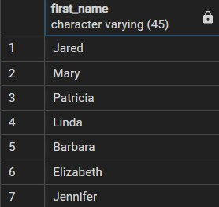
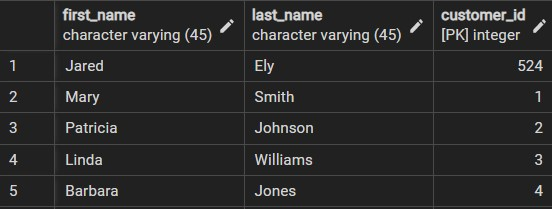
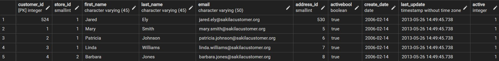
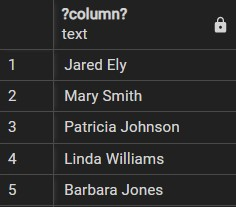

# `SELECT` Statement

- We query the database using the SQL `SELECT` statement.
- `SELECT` has many important clauses like:
  - `DISTINCT` -> Select distinct rows.
  - `ORDER BY` -> Sort rows.
  - `WHERE` -> Filter rows.
  - `LIMIT` and `FETCH` -> Select subset of rows.
  - `GROUP BY` -> Grouping rows.
  - `HAVING` -> Filter groups.
  - `INNER JOIN`, `LEFT JOIN`, `FULL OUTER JOIN`, `CROSS JOINS` -> Joining tables.
  - `UNION`, `INTERSECT`, `EXCEPT` -> Perform set operations.

## `SELECT` Syntax

```sql
SELECT
  select_list
FROM
  table_name;
```

- `select_list` can be a column or a list of columns in table from which we want to retrieve data.
- When we have multiple columns or a list of columns, we need to seperate each column using `,`.
- If you want to select data from all the columns, we can use `*` instead of specifying all the columns.
- The `select_list` can also contain expression or literal values.
- We specify the name of the table after the `FROM` clause.
- `FROM` clause is optional, if we do not query data from any table, `FROM` can be omitted.
- In `SELECT` statement, `FROM` clause is evaluated before `SELECT`.
- `FROM` → `SELECT`.

## Examples

### Query data from single column

```sql
SELECT first_name
FROM customer;
```



### Query data from multiple columns

```sql
SELECT
  first_name,
  last_name,
  customer_id
FROM
  customer;
```



### Query data from all columns

```sql
SELECT
  *
FROM
  customer;
```



#### Note on `SELECT` with `*`

- `*` is a shorthand for all columns and we use it to save some typing instead of listing all the columms.
- However, it is not a good practice to use it when we embed SQL in applications code like Python, Java, Nodejs, etc, because:
  - **DB Performance**: It affects performance as a table can have a long list of columns which might not be necessary to include.
  - **Application Performance**: Retrieving unnecessary data from the db increases the traffic between the db server and applicaiton server which results in slow application performance and less scalability.

### Query using expression

```sql
SELECT
  first_name || ' ' || last_name
FROM
  customer;
```



- Here we are using `||` operator which is used to concatenate columns data.

### Query with expression with omitting `FROM`

```sql
SELECT 5 * 3;
```


