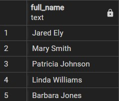
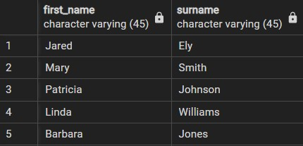
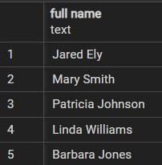

# Column Alias

- Allows us to assign a temporary column name to the colum or an expression that we use in `SELECT` to query data.
- It only exists temporarily during the execution of the query.

## Syntax

```sql
SELECT
  column_name as alias_name
FROM
  table_name;
```

- The `column_name` is assigned `alias_name` using `AS` keyword which is optional.

```sql
SELECT
  column_name alias_name
FROM
  table_name;
```

- We can also use column alias for expression as follows:

```sql
SELECT
  expression AS alias_name
FROM
  table_name;
```

- The main purpose is to display column names in a more meaningful manner in query output.

## Examples

### Assigning column alias to a column

```sql
SELECT
  first_name || ' ' || last_name AS full_name
FROM
  customer;
```



```sql
SELECT
  first_name,
  last_name surname
FROM
  customer;
```



## Column alias with space

- If a column alias contains one or more spaces, we need to surround it with double quotes `""`.

```sql
SELECT  column_name AS "column alias";
```

### Example

```sql
SELECT
  first_name || ' ' || last_name AS "full name"
FROM
  customer;
```


