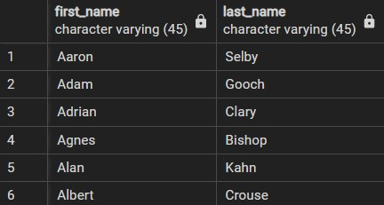
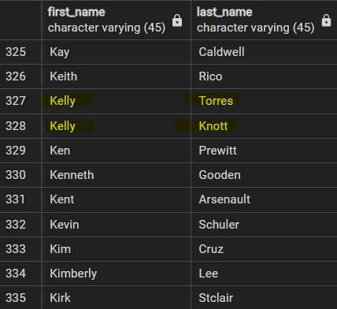
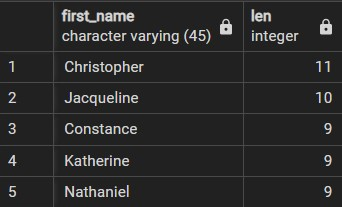
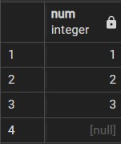
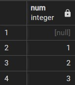
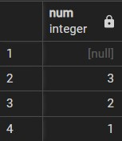
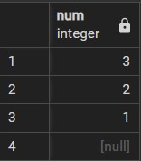

# `ORDER BY` Clause

- When we query table using `SELECT`, it returns data in an unspecified order.
- To sort the rows in ascending or descending order, we use `ORDER BY` clause in `SELECT`.

## Syntax

```sql
SELECT
  select_list
FROM
  table_name
ORDER BY
  sort_expression_1 [ASC | DESC],
  ...
  sort_expression_N [ASC | DESC];
```

- The `sort_expression` can be a column or an expression.
- `ASC` stands for ascending order which is the default value and `DESC` stands for descending order.
- `FROM` → `SELECT` → `ORDER BY`.

## Examples

### Sort rows by one column

```sql
SELECT
  first_name,
  last_name
FROM
  customer
ORDER BY
  first_name ASC;
```



### Sort rows by multiple columns

```sql
SELECT
  first_name,
  last_name
FROM
  customer
ORDER BY
  first_name ASC,
  last_name DESC;
```



- Here `ORDER BY` clause sorts `first_name` column first in ascending order and then sorts `last_name` column in descending order.

### Sort rows by expressions

```sql
SELECT
  first_name,
  LENGTH(first_name) AS len
FROM
  customer
ORDER BY
  len DESC;
```



- Here `LENGTH()` function accepts a string and returns the length of the string.

## `ORDER BY` clause with `NULL`

- If data is unknown, it is indicated by `NULL`.
- When we sort rows that contains `NULL`, we can specify the order of `NULL` with other non-null values by using `NULLS FIRST` or `NULLS LAST` option of the `ORDER BY` clause.

```sql
ORDER BY sort_expression [ASC | DESC] [NULLS FIRST | NULLS LAST]
```

- `NULLS FIRST` places `NULL` before other non-null values and `NULLS LAST` places `NULL` after other non-null values.

### Example

```sql
-- Creating temporary table to work on
CREATE TABLE sort_demo(
  num INT
);

-- Insert data in sort_demo table
INSERT INTO sort_demo(num)
VALUES (1),(2),(3),(null);
```

```sql
SELECT
  num
FROM
  sort_demo
ORDER BY
  num;
```



- By default `ORDER BY` sorts table in ascending order and places `NULL` values at the end.
- So if we are using `ASC` option, then `ORDER BY` uses `NULLS LAST` option by default and when we are using `DESC` option, `ORDER BY` uses `NULLS FIRST` option by default.

```sql
SELECT num
FROM sort_demo
ORDER BY num NULLS FIRST;
```



```sql
SELECT num
FROM sort_demo
ORDER BY num DESC;
```



```sql
SELECT num
FROM sort_demo
ORDER BY num DESC NULLS LAST;
```


