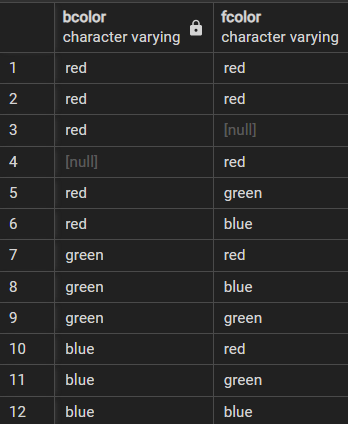
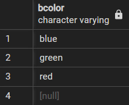
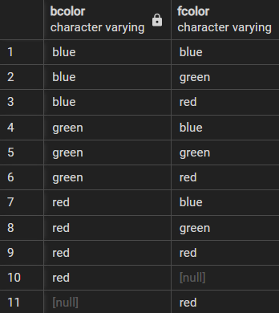
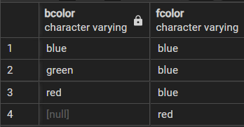

# `SELECT DISTINCT`

- Removes duplicates from the result set.
- Keep one row of each duplicate group.
- Can be applied to one or more columns in the select list.

## Syntax

```sql
SELECT
    DISTINCT column_1, column_2
FROM
    table_name;
```

- When we have a single column, it uses that column for evaluating duplicates.
- When we have multiple columns, combination of both is used to evaluate duplicates.

## Examples

```sql
-- Creating demo table
CREATE TABLE distinct_demo(
    id serial NOT NULL PRIMARY KEY,
    bcolor VARCHAR,
    fcolor VARCHAR
);

-- Inserting into distinct_demo
INSERT INTO distinct_demo (bcolor, fcolor)
VALUES
    ('red', 'red'),
    ('red', 'red'),
    ('red', NULL),
    (NULL, 'red'),
    ('red', 'green'),
    ('red', 'blue'),
    ('green', 'red'),
    ('green', 'blue'),
    ('green', 'green'),
    ('blue', 'red'),
    ('blue', 'green'),
    ('blue', 'blue');

-- Displaying distinct_demo data
SELECT
    bcolor, fcolor
FROM
    distinct_demo;
```



### Distinct one column

```sql
SELECT
    DISTINCT bcolor
FROM
    distinct_demo
ORDER BY
    bcolor;
```



### Distinct multiple columns

```sql
SELECT
    DISTINCT bcolor,
    fcolor
FROM
    distinct_demo
ORDER BY
    bcolor,
    fcolor;
```



- Because we have specified both `bcolor` and `fcolor` columns in the `SELECT DISTINCT` clause, PostgreSQL combined the values in both `bcolor` and `fcolor` columns to evaluate the uniqueness.

# `SELECT DISTINCT ON`

```sql
SELECT
    DISTINCT ON (column_1) AS column_alias,
    column_2
FROM
    table_name
ORDER BY
    column_1,
    column_2;
```

- `DISTINCT ON(expression)` keeps the first row of each duplicates.
- It is a good practice to use `ORDER BY` with `DISTINCT ON` to sort the result set excluding of duplicates.

## Example

```sql
SELECT
    DISTINCT ON (bcolor) bcolor,
    fcolor
FROM
    distinct_demo
ORDER BY
    bcolor,
    fcolor;
```


