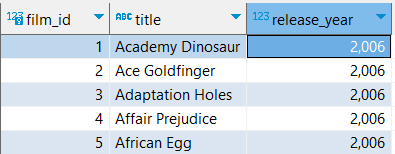
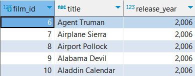

# `LIMIT` Clause

- It limits the number of rows returned by the query.
- It is an optional clause.

## Syntax

```sql
SELECT select_list
FROM table_name
ORDER BY sort_expression
LIMIT row_count
```

- The query returns `row_count` number of rows.
- If `row_count` is zero, the query returns an empty set.
- If `row_count` is null, the query returns the same result set as it would return without the `LIMIT` clause.

## Examples

```sql
SELECT
    film_id,
    title,
    release_year
FROM
    film
ORDER BY
    film_id
LIMIT 5;
```



# `LIMIT` with `OFFSET`

- Used to skip rows.

## Syntax

```sql
SELECT select_list
FROM table_name
LIMIT row_count
OFFSET row_to_skip;
```

- The above statement first skips `row_to_skip` rows before returning `row_count` rows generated by the query.
- If `row_to_skip` is zero, query will work as if it does not have any `OFFSET`.

## Example

```sql
SELECT
    film_id,
    title,
    release_year
FROM
    film
ORDER BY
    film_id
LIMIT 5
OFFSET 5;
```


