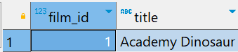
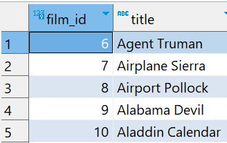

# `FETCH` Clause

- The `LIMIT` clause is used in many other RDBMS but it not a SQL standard.
- Thus PostgreSQL supports use of `FETCH` to retrieve a number of rows returned by the query.

## Syntax

```sql
OFFSET start { ROW | ROWS }
FETCH { FIRST | NEXT } [ row_count ] { ROW | ROWS } ONLY
```

- `ROW` is the synonym for `ROWS`, `FIRST` is the synonym for `NEXT`, so we can use them interchangeably.
- `start` is an integer that must be zero or positive.
- By default, it is zero if the `OFFSET` clause is not specified.
- In case the `start` is greater than the number of rows in the result set, no rows are returned.
- The `row_count` is 1 or greater.
- By default, the default value of `row_count` is 1 if you do not specify it explicitly.
- `OFFSET` must come before `FETCH`.

## `FETCH` vs `LIMIT`

- Both are functionally equivalent but if you plan to make your application compatible with other database systems, you should use `FETCH` clause because it follows the standard SQL.

## Example

### `FETCH` clause to select the first film sorted by titles in ascending order

```sql
SELECT
    film_id,
    title
FROM
    film
ORDER BY title
FETCH FIRST ROW ONLY;
```



- Above query can also be written as follows:

```sql
SELECT
    film_id,
    title
FROM film
ORDER BY title
FETCH FIRST 1 ROWS ONLY;
```

### Fetch the next 5 films after the first 5 and order by title in ascending order

```sql
SELECT
	film_id,
	title
FROM film
ORDER BY title
OFFSET 5 ROWS
FETCH NEXT 5 ROWS ONLY;
```



- Above query can also be written as follows:

```sql
SELECT
	film_id,
	title
FROM film
ORDER BY title
OFFSET 5 ROWS
FETCH FIRST 5 ROWS ONLY;
```
