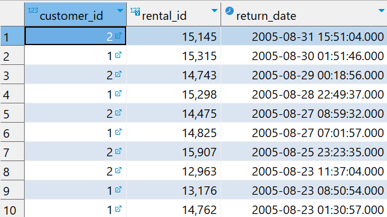
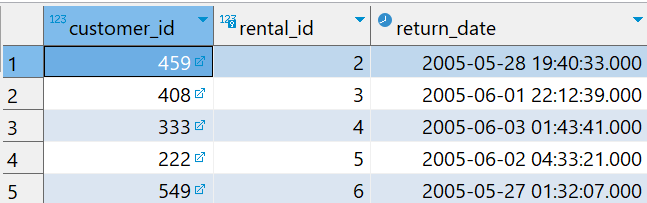

# `IN` Operator

- Used to check whether the value matches any value in the list of values and returns true if matched.

## Syntax

```sql
value IN (value1, value2, ...)
```

## Examples

**Fetch rental information of customer id 1 and customer id 2.**

```sql
SELECT
    customer_id,
    rental_id,
    return_date
FROM
    rental
WHERE
    customer_id IN (1,2)
ORDER BY
    return_date DESC;
```



# `NOT IN` Operator

- We combine the `IN` and `NOT` operators to select rows whose values do not match the values in the list.

## Example

**Fetch all rentals with customer id not 1 and 2.**

```sql
SELECT
    customer_id,
    rental_id,
    return_date
FROM
    rental
WHERE
    customer_id NOT IN (1,2);
```


