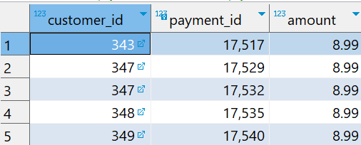
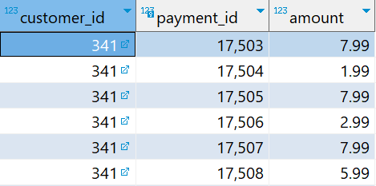
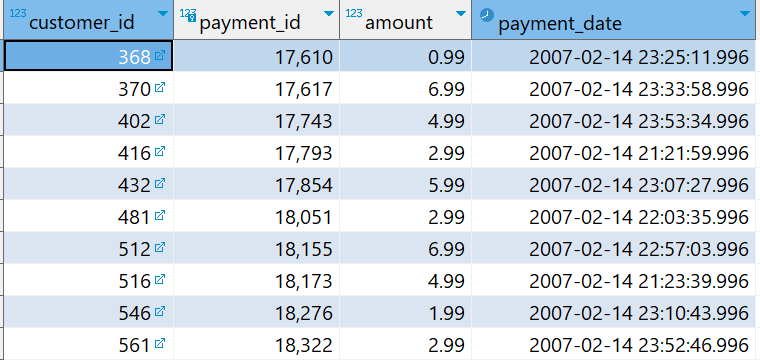

# `BETWEEN` Operator

- Matches a value against a range of values.

## Syntax

```sql
value BETWEEN low AND high;
```

- If the `value` is greater than or equal to `low` value and less than or equal to the `high` value, the expression returns true, otherwise, it returns false.
- We can rewrite the above query as follows:

```sql
value >= low AND value <= high;
```

- To check a value out of range, we can combine the `NOT` operator with the `BETWEEN` operator:

```sql
value NOT BETWEEN low AND high;
```

- We can also rewrite the above query as follows:

```sql
value < low OR value > high;
```

- We often use `BETWEEN` in `WHERE` clause.

## Examples

**Select payments whose amount is between $8 and $9**

```sql
SELECT
    customer_id,
    payment_id,
    amount
FROM
    payment
WHERE
    amount BETWEEN 8 AND 9;
```



**Get payments whose amounts is not in between $8 and $9**

```sql
SELECT
    customer_id,
    payment_id,
    amount
FROM
    payment
WHERE
    amount NOT BETWEEN 8 AND 9;
```



**Get payments whose data is between `2007-02-07` and `2007-02-15`**

```sql
SELECT
    customer_id,
    payment_id,
    amount,
    payment_date
FROM
    payment
WHERE
    payment_date BETWEEN '2007-02-07' AND '2007-02-15';
```


