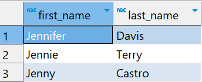
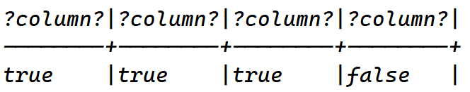

# `LIKE` Operator

- Used for pattern matching along with wildcard operators.

## Syntax

```sql
SELECT select_list
FROM table_name
WHERE value LIKE pattern;
```

## Example

```sql
SELECT
    first_name,
    last_name
FROM customer
WHERE
    first_name LIKE "Jen%";
```



- In the above query, `Jen%` is a pattern.
- The query returns rows whose values in the `first_name` column begins with `Jen` and maybe followed with other sequence of characters.
- This is called as pattern matching.
- Here, `%` is a wildcard operator.

### `LIKE` and wildcards

```sql
SELECT
	'foo' LIKE 'foo',
	'foo' LIKE 'f%',
	'foo' LIKE '_o_',
	'bar' LIKE 'b_';
```



- In first expression, query returns true because there is no wildcard, so `LIKE` behaves as `=`.
- Second expression returns true, because it matches any string that begins with letter `f` and followed by any number of characters.
- Third expression returns true, because `_` wildcard checks for a single character and `foo` matches with the patter `_o_`,
- Fourth expression returns false, because `bar` has three characters and pattern is checking only for 1 character after `b`.

# `NOT LIKE`

- Just use `NOT` operator and query fetches results which does not match the passed pattern.
