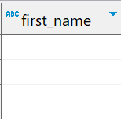
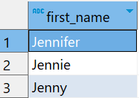

# `ILIKE` Operator

- Similar to `LIKE` but in addition, `ILIKE` matches value case-insensitively.

## Examples

```sql
SELECT first_name
FROM customer
WHERE first_name LIKE 'jen%'
```



- It returned 0 rows, because `LIKE` is case-sensitive.

```sql
SELECT first_name
FROM customer
WHERE first_name ILIKE 'jen%';
```


