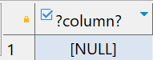
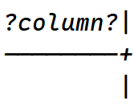

# `IS NULL` Operator

- In db, `NULL` resembles missing information.
- It is not a value, so we cannot compare it with any other values like numbers or strings.
- Comparing `NULL` with any other value will result in `NULL`, but `NULL` is not equal to `NULL`.

```sql
SELECT NULL = NULL;
```




- When we try to fetch a row whose column might be `NULL`, we cannot use `=` operator because comparing any value with `NULL` returns `NULL` which means no rows will be returned.
- Hence, we use `IS NULL`.

## Syntax

```sql
SELECT select_list
FROM table_name
WHERE value [ IS NULL | IS NOT NULL ];
```
