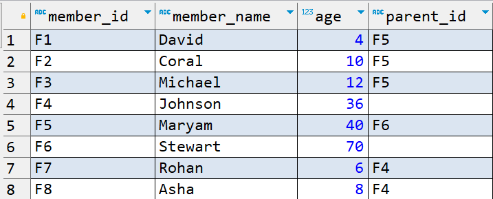

# `JOINS`

- Used to combine columns from one or more tables based on the values of the common columns between tables.
- The common columns are typically the primary key columns of the first table and foreign key columns of the second table.
- Column name does not matter but the data that is stored matters.
- Values has to be similar in both the columns.
- PostgreSQL supports following joins:
  - `INNER JOIN` or `JOIN`
  - `LEFT JOIN` or `LEFT OUTER JOIN`
  - `RIGHT JOIN` or `RIGHT OUTER JOIN`
  - `FULL JOIN` or `FULL OUTER JOIN`
  - `CROSS JOIN`
  - `NATURAL JOIN`
  - `SELF JOIN`

_Creating office database_

```sql
CREATE DATABASE office;
```

_Creating tables for office db_

```sql
CREATE TABLE employee(
    emp_id VARCHAR(20),
    emp_name VARCHAR(50),
    salary INT,
    dept_id VARCHAR(20),
    manager_id VARCHAR(20)
);

CREATE TABLE department(
    dept_id VARCHAR(20),
    dept_name VARCHAR(50)
);

CREATE TABLE manager(
    manager_id VARCHAR(20),
    manager_name VARCHAR(50),
    dept_id VARCHAR(20)
);

CREATE TABLE projects(
    project_id VARCHAR(20),
    project_name VARCHAR(100),
    team_member_id VARCHAR(20)
);
```

_Inserting data_

```sql
INSERT INTO employee(
    VALUES ('E1', 'Rahul', 15000, 'D1', 'M1'),
           ('E2', 'Manoj', 15000, 'D1', 'M1'),
           ('E3', 'James', 55000, 'D2', 'M2'),
           ('E4', 'Michael', 25000, 'D2', 'M2'),
           ('E5', 'Ali', 20000, 'D10', 'M3'),
           ('E6', 'Robin', 35000, 'D10', 'M3')
);

INSERT INTO department(
    VALUES ('D1', 'IT'),
           ('D2', 'HR'),
           ('D3', 'Finance'),
           ('D4', 'Admin')
);

INSERT INTO manager(
    VALUES ('M1', 'Prem', 'D3'),
           ('M2', 'Shripadh', 'D4'),
           ('M3', 'Nick', 'D1'),
           ('M4', 'Cory', 'D1')
);

INSERT INTO projects(
    VALUES ('P1', 'Data Migration', 'E1'),
           ('P1', 'Data Migration', 'E2'),
           ('P1', 'Data Migration', 'M3'),
           ('P2', 'ETL Tool', 'E1'),
           ('P2', 'ETL Tool', 'M4')
);
```

**Example tables**

_`employee`_ table


_`department`_ table


_`manager`_ table


_`projects`_ table


## `INNER JOIN`

- Can be represented with keywords `INNER JOIN` or `JOIN`.
- It is the default join.

```sql
-- Fetch the employee name and the department name they belong to.
SELECT e.emp_name, d.dept_name
FROM employee e
JOIN department d ON e.dept_id = d.dept_id;
```


- Matching will be based on `dept_id` column and only those records will be fetched which are present in both the tables.
- Every single column is not matched.
- In `employee` table we have departments as `D1`, `D2` and `D10`.
- In `department` table we have departments as `D1`, `D2`, `D3` and `D4`.
- Since, only `D1` and `D2` are the common `dept_id` in both the tables, only those records will be fetched.

```sql
-- Joinig 3 tables.
-- Fetch the employee names along with manager and department names who are assigned departments.
SELECT
  e.emp_name,
  d.dept_name,
  m.manager_name
FROM
  employee e
JOIN department d ON
  d.dept_id = e.dept_id
JOIN manager m ON
  m.manager_id = e.manager_id;
```


### `USING` keyword

- Since both the table `employee` and `department` have same `dept_id` column, we can use `USING` keyword as follows:

```sql
SELECT
  e.emp_name,
  d.dept_name
FROM
  employee e
JOIN department d USING (dept_id);
```

- This will produce the same result as above.

## `LEFT JOIN`

- Also called as `LEFT OUTER JOIN`.
- `LEFT JOIN` = `INNER JOIN` + any additional records in the left table.

```sql
-- Fetch all the employee names and their department names they belong to.

SELECT
	e.emp_name,
	d.dept_name
FROM
	employee e
LEFT JOIN department d ON
	e.dept_id = d.dept_id;
```


```sql
-- Fetch details of all the employees, their managers, their departments and the projects they are working on.

SELECT
	e.emp_name,
	m.manager_name,
	d.dept_name,
	p.project_name
FROM
	employee e
JOIN manager m ON
	m.manager_id = e.manager_id
LEFT JOIN department d ON
	e.dept_id = d.dept_id
LEFT JOIN projects p ON
	p.team_member_id = e.emp_id;
```


## `RIGHT JOIN`

- Also called as `RIGHT OUTER JOIN`
- `RIGHT JOIN` = `INNER JOIN` + any additional records in the right table.
- Similar to `LEFT JOIN`.

## `FULL OUTER JOIN` or `FULL JOIN`

- `INNER JOIN`: Fetches only matching records in the both the tables on the join condition.
- `LEFT JOIN`: `INNER JOIN` + any additional records in the left table.
- `RIGHT JOIN`: `INNER JOIN` + any additional records in the right table.
- `FULL OUTER JOIN` = `INNER JOIN` + `LEFT JOIN` + `RIGHT JOIN`

```sql
SELECT
    e.emp_name,
    d.dept_name
FROM
    employee e
FULL JOIN department d ON
    d.dept_id = e.dept_id;
```


- Internally for records 1 to 4, `INNER JOIN` was performed, 5 to 6, `RIGHT JOIN` was performed and for records 7 to 8, `LEFT JOIN` was performed.

## `CROSS JOIN`

- Also referred as `CARTESIAN JOIN` as it returns the cartesian product.
- Every record from the left table will match with every record from the right table.
- We don't require `ON` clause and condition.

```sql
SELECT
    e.emp_name,
    d.dept_name
FROM
    employee e
CROSS JOIN department d;
```


- Here every single employee from the `employee` table is matched with every single department from the `department` table.
- The total records returned by `CROSS JOIN` = no. of records from the left hand table \* no. of records from the right hand table.

- Consider the below table `company`:


- This table data will be common to all the employees of a particular company.
- So this will be a good example for `CROSS JOIN`.

```sql
-- Write a query to fetch employees who are assigned their respective departments.
-- Also display the company and location of all those employees.

SELECT
    e.emp_name,
    d.dept_name,
    c.company_name,
    c.company_location
FROM
    employee e
INNER JOIN department d ON
    d.dept_id = e.dept_id
CROSS JOIN company c;
```


## `NATURAL JOIN`

- The type of join to be used is decided by the SQL and the not the user.
- We don't need to specify join condition because SQL will decide on which column the join should happen.
- This decision is made on the basis of column name.

```sql
SELECT
	e.emp_name,
	d.dept_name
FROM employee e
NATURAL JOIN department d;
```


- We have a common column `dept_id` between `employee` and `department` table.
- For tables, who does not share common columns, `NATURAL JOIN` can go horribly wrong.
- In such cases, it generally performs `CROSS JOIN`.
- Hence, it is a bad idea to use `NATURAL JOIN` as we are depending on the SQL to decide the condition and thus produce irrelevant results.

## `SELF JOIN`

- Joining a table with itself.
- We don't have any specific keyword for this join.
- It can be `JOIN`, `LEFT JOIN`, etc.
- Whenever we are trying to use a table more than once and trying to join to itself, it is `SELF JOIN`.

```sql
-- Creating family table
CREATE TABLE family(
    member_id VARCHAR(5),
    member_name VARCHAR(20),
    age INT,
    parent_id VARCHAR(5)
);

-- Inserting data in family table
INSERT INTO family(
    VALUES ('F1', 'David', 4, 'F5'),
           ('F2', 'Coral', 10, 'F5'),
           ('F3', 'Michael', 12, 'F5'),
           ('F4', 'Johnson', 36, ''),
           ('F5', 'Maryam', 40, 'F6'),
           ('F6', 'Stewart', 70, ''),
           ('F7', 'Rohan', 6, 'F4'),
           ('F8', 'Asha', 8, 'F4')
);
```



```sql
-- Fetch child name and their age corresponding to their parent's name and age.

SELECT
	child.member_name AS child_name,
	child.age AS child_age,
	parent.member_name AS parent_name,
	parent.age AS parent_age
FROM
	"family" AS child
JOIN "family" AS parent ON
	child.parent_id = parent.member_id;
```


